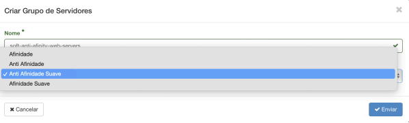

Grupos de servidores definem coleções de máquinas virtuais (VMs) para as quais podem
ser dadas propriedades específicas. Por exemplo, a política de um grupo de servidores
pode especificar que as VMs neste grupo não devem ser colocadas no mesmo hardware
físico devido a requisitos de disponibilidade.

Grupos de servidores são específicos para cada projeto, e não podem ser compartilhados
entre projetos.

É possível escolher entre quatro tipos de políticas para um grupo de servidores:

- **Afinidade**: Define uma política de afinidade rígida. Nesta regra o agendador é
  obrigado a executar uma instância computacional (VM) nova no mesmo hardware de
  outra instância existente com o mesmo grupo de servidores. Caso não haja recursos
  suficientes no hardware para a execução da nova instância computacional (VM)
  junto com uma já existente com o mesmo grupo de servidores, o agendador não irá
  executar.
- **Anti Afinidade**: Define uma política de anti afinidade rígida. Nesta regra, o
  agendador é obrigado a executar uma instância computacional (VM) nova em um
  hardware diferente de outra instância existente com o mesmo grupo de servidores.
  Caso não haja recursos suficientes em outro hardware para a execução da nova
  instância computacional(VM), o agendador não irá executar
- **Afinidade Suave**: Define uma política de execução flexível. Nesta regra uma
  instância computacional (VM) nova tenta executar no mesmo hardware de outra
  instância existente com o mesmo grupo de servidores. Caso não haja recursos
  suficientes no mesmo hardware para a execução da nova instância computacional
  (VM) junto com uma já existente com o mesmo grupo de servidores, o agendador irá
  tentar em outro hardware.
- **Anti Afinidade Suave**: Define uma política de anti afinidade flexível. Nesta regra, o
  agendador tenta executar uma instância computacional (VM) nova em um hardware
  diferente de outra instância existente com o mesmo grupo de servidores. Caso não
  haja recursos suficientes em outro hardware e haja recursos no mesmo hardware de
  uma instância com o mesmo grupo de servidores, o agendador não irá executar.

Políticas de afinidade são normalmente utilizadas por arquiteturas que exigem garantia de
throughput e políticas de anti afinidade são normalmente utilizadas em arquiteturas que
exigem disponibilidade.

