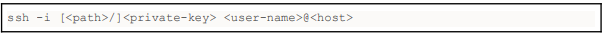
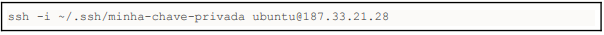
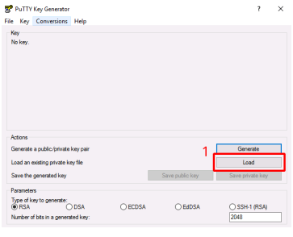
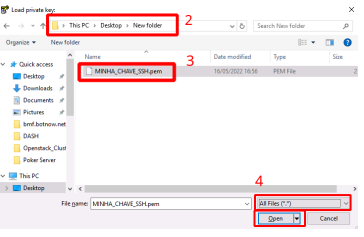
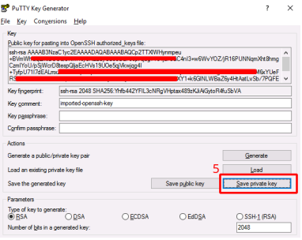
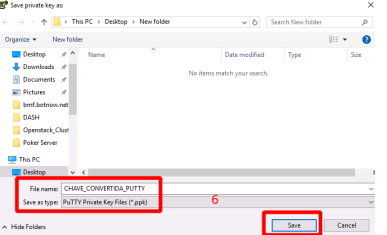
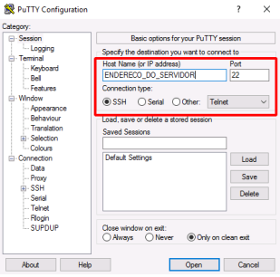
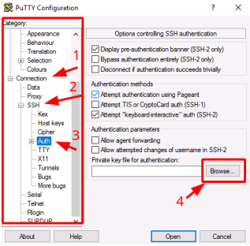
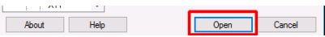
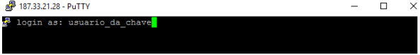

Para conectar via SSH é necessário que a instância computacional esteja acessível seja via
IP flutuante (veja Tutorial IPs Flutuantes) direto na instância ou seja via IP flutuante em um
balanceador de carga (veja: Exposição de Load Balancer) e configuração das regras de
liberação de acesso ao protocolo, porta e IP/CIDR em um grupo de segurança (veja:
Tutorial Grupos de Segurança).

##Utilização da interface de linha de comando SSH
Para conectar via SSH com uma chave informe a linha de comando:

onde:

- `-i` - indica o caminho do arquivo da chave privada
- `<path>` - parâmetro opcional indica o diretório/pasta onde foi salva a chave privada
  (e.g. para chaves armazenadas no diretório/pasta home do usuário no
  sub-diretório/sub-pasta “oculta” .ssh, utilize ~/.ssh). Não precisa ser definido quando
  o arquivo de chave privada estiver no mesmo diretório pasta corrente da execução
  do comando.
- `<private-key>` - indica o nome do arquivo de chave privada salvo após a criação do
  par de chaves (key pair) pública/privada
- `<user-name>` - indica o nome do usuário padrão da instância computacional ou do
  usuário criado através do [cloud-init](https://cloudinit.readthedocs.io/en/latest/).
- ● `<host>` - indica o nome (DNS) ou IP flutuante utilizado para acessar a instância
  computacional

Exemplo:

## Utilização do Putty como client SSH

### Convertendo a chave privada SSH para o Putty

:::note

**Atenção**: Esse procedimento deve ser feito após criar e baixar a chave privada do painel
administrativo para seu computador.

:::

O primeiro passo é realizar o download do PuttyGen no endereço [endereço](https://the.earth.li/~sgtatham/putty/latest/w64/puttygen.exe)

Ao abrir o puttygen, teremos a seguinte tela e procederemos conforme os passos abaixo:

1. . Clicar em **“Load”**
2. . Na nova janela que abriu, vá até o diretório onde foi salvo a PEM
3. Selecione a chave desejada
4. No tipo de arquivo selecione a opção **“All files (_._)”** e clique em “Open”
5. Após importar a chave, clicar no botão **“Save Private Key”**
6. Escolher um nome e salvar o arquivo convertido

Após realizar todos os passos você conseguirá utilizar o novo arquivo para conectar-se via
putty.

### Conectando-se ao servidor utilizando Putty + Chave privada

-Abrir o putty e preencher o endereço ou ip do servidor conforme imagem:

- Carregar a chave privada:

1. No menu à esquerda, clicar em Connections
2. Clicar em SSH
3. Clicar em Auth
4. Clicar em Browse … e selecionar a chave

   

- Para conectar-se, no rodapé da janela basta clicar em Open

  

Será solicitado o nome de usuário

