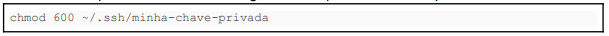

# Tutorial de Pares de Chave / Key Pai(public/private)

Um par de chave permite que você se conecte às suas instâncias computacionais via SSH
(com chaves do tipo SSH) ou via WinRM (com chaves do tipo X509).

É possível selecionar um par de chaves existentes, importar uma chave pública ou gerar um
novo par de chaves.

Os pares de chaves gerados devem ter suas chaves privadas exportadas e salvas em um
local seguro para serem utilizadas posteriormente por um cliente SSH (e.g. ssh OpenSSH,
Putty, etc) ou WinRM. As chaves públicas são automaticamente configuradas para ficarem
visíveis para as imagens através do [cloud-init](https://cloudinit.readthedocs.io/en/latest/). Chaves adicionais podem ser configuradas
através do script [cloud-init](https://cloudinit.readthedocs.io/en/latest/).

## Criar Par de Chaves

Um par de chaves pode ser gerado a partir do menu `Projeto->Computação->Pares de
Chave`, botão “Criar par de chaves” ou a partir da tela de criação de instâncias na opção
Key Pair, botão “Criar par de chaves". Após o clique no botão irá ocorrer o download
automático da chave privada.

Salve a chave privada em um local seguro e com permissões adequadas

## Importar Par de Chaves

Uma chave pública já gerada anteriormente pela opção acima ou localmente e pode
importada à partir da tela de criação de instâncias na opção Key Pair botão "Importar par de
chaves" ou à partir do menu Projeto->Computação->Pares de Chave, botão "Importar
Chave Pública”.

