## Redes

Uma rede na plataforma One Cloud funciona como uma espécie de VLAN, onde é possível
configurar sub-redes.

Para criar uma nova rede, selecione o menu Projeto->Rede->Redes, botão “Criar Rede”

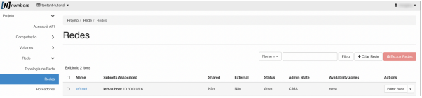

O assistente permite que na criação da rede já seja criado também pelo menos uma
sub-rede e sua configuração de DHCP, DNS e Rotas.

Se o campo Ativar Estado Administrativo estiver marcado (padrão) a rede será habilitada,
caso contrário a rede não será ativada inicialmente, entretanto, poderá ser habilitada
posteriormente.

O campo criar sub-rede permite a criação de uma sub-rede no momento da criação da rede.
Entretanto, pode ser feito posteriormente para mais sub-redes.

Zonas de disponibilidade onde os agentes DHCP possam ser agendados. Deixar isto sem
configurar é equivalente a selecionar todas as zonas de disponibilidade. No momento, todos
os agentes DHCPs executam em uma única zona de disponibilidade.

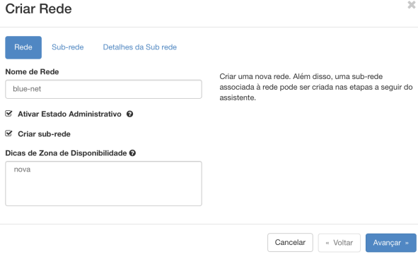

Ainda na tela do assistente para criação de rede, no próximo passo, segue-se a criação da
sub-rede.

É necessário inserir um "Endereço de Rede" e um "IP de Gateway" válidos. O endereço de
rede deve ser informado em formato CIDR (por exemplo, 192.168.0.0/24, 2001: DB8 :: / 48).

Versão de IP: IPv4 ou IPv6

IP de Gateway: Endereço IP do Gateway (por exemplo, 192.168.0.254) O valor padrão é o
primeiro IP do endereço de rede (por exemplo, 192.168.0.1 para 192.168.0.0/24, 2001: DB8
:: 1 para 2001: DB8 :: / 48). Se você usar o padrão, deixe em branco. Se você não quiser
usar um gateway, marque a caixa de seleção "Desabilitar Gateway”.

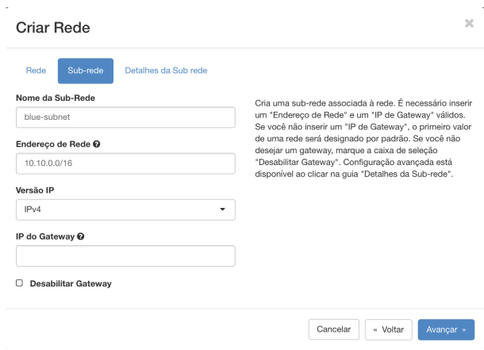

Configuração avançada (DHCP, DNS e rotas) está disponível ao clicar na guia "Detalhes da
Sub-rede”.

O campo **“Habilitar DHCP”** permite que os novos elementos na rede recebem IP
automaticamente.

O campo **"Pools de Alocação”** refere-se às faixas de IPs para entregas, atribuídos
dinamicamente aos elementos na rede que não receberem IPs estáticos. No exemplo, a
rede 10.10.0.0/16, tem os IPs 10.10.0.2 (pois o primeiro IP 10.10.0.1 foi entregue para o
gateway) a 10.10.0.99 disponíveis para serem atribuídos estaticamente, assim, os IPs
10.10.0.101, 10.10.0.102 e 10.10.0.103 devem ser entregues para os agentes DHCP.

O campo **“Servidores de nome DNS”**, refere-se a lista de endereços IP de servidores DNS
para esta sub-rede. Uma entrada por linha. Os servidores DNS são utilizados para
resolução de nomes.

Para o campo **“Rotas de Host"** veja o tópico.

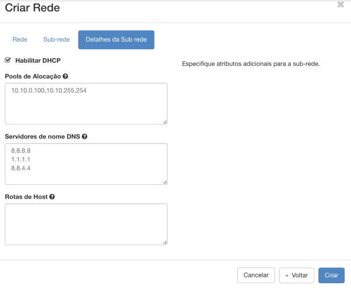

A rede pública “external” é a rede One Cloud que entrega/expõe IPs entregue direto para
hosts (instâncias de VM), IPs flutuantes, load balancers, roteadores, etc.
A coluna External informa se a rede é pública ou não.
A coluna Shared indica se a rede é compartilhada entre diferentes projetos ou não. Uma
rede pode ser compartilhada. Atualmente não existe uma forma de compartilhar a rede
diretamente pelo dashboard administrativo do One Cloud.
Para editar uma rede criada basta clicar no botão “Editar Rede” à direita na coluna Actions
ou clique no link à esquerda na coluna Name no nome da rede desejada e em seguida no
botão “Editar rede"

Para excluir uma rede, se ela ainda não foi utilizada, basta clicar em e escolher
a opção **"Excluir Rede”** ou marcar a caixa (checkbox) à esquerda e clicar no botão vermelho
“Excluir Redes". Se a rede já tiver sido utilizada, é necessário antes excluir ou desassociar
os elementos que estão utilizando esta rede.

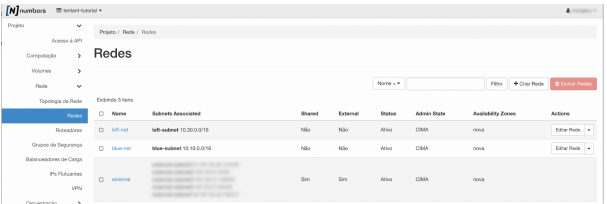

### Sub-Redes

Uma sub-rede é definida por um bloco determinado por um CIDR e demais opções já
descritas no tópico **“Criar Redes”**.
Para editar uma sub rede é necessário clicar no link à esquerda na coluna Name no nome
da rede desejada
A seguir, clique no botão “Editar Sub-rede”.
Para excluir a sub-rede, o comportamento é o mesmo da tela anterior (Redes), tanto pelo

botão 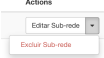 quanto marcando uma ou mais sub-redes na coluna à esquerda e
clicando no botão vermelho **“Excluir Sub-redes"**.

O botão “Criar sub-rede” permite criar sub-redes posteriormente ao momento de criação da
rede. Esta opção é mais flexível, dando a possibilidade de criar múltiplas sub-redes

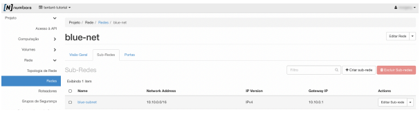

Configuração de Rotas Estáticas da Sub-Rede

Todo novo elemento na rede recebe uma rota padrão com o gateway padrão sendo o
gateway de resolução. Entretanto, para fins de otimização e resolução de conflitos de rotas
pode ser necessário criar rotas adicionais.

:::note

**Atenção**: Por questões de performance no lookup das rotas de rede no host, atualmente
as rotas estão definidas em no máximo 20. É altamente recomendável que em caso de
necessidade de mais de vinte rotas, sejam criadas sub-redes adicionais com as rotas
adicionais e interfaces de redes adicionais para o router e instâncias computacionais
sejam criadas e atreladas a sub-rede com as rotas adicionais, dessa forma, o lookup de
rotas será delegado para a interface que contém a rota desejada.

:::

Uma rota estática em uma sub-rede pode ser configurada durante a criação da sub-rede
(ver Sub-Redes) ou posteriormente clicando no menu Projeto->Rede->Redes e depois no
link da rede que contém a sub-rede desejada, em seguida na aba Sub-Rede, clicando no
botão Editar Sub-rede

As rotas podem ser anunciadas para os hosts através do campo “Rotas de Host". Cada
entrada é: destination_cidr, nexthop (por exemplo, 192.168.200.0/24,10.56.1.254) e uma
entrada por linha

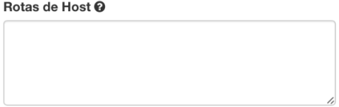

:::note

**Atenção**: As novas rotas não serão atribuídas às instâncias computacionais existentes
em execução. Somente após reiniciar as instâncias as novas rotas serão obtidas. Caso
não seja possível reiniciar as instâncias, é possível adicionar as novas rotas
manualmente em cada host existente em execução.

:::

### Portas

Na plataforma One Cloud, as portas definidas na configuração de uma rede funcionam
como dispositivos de rede similares às placas/cartões de rede.

Uma porta pode ser criada em uma sub-rede e posteriormente atribuída a um dispositivo ou
pode ser criada e atribuída a um disponível (existente) no momento da sua criação.

Em caso de mudança de rede ou IP de uma instância Linux, uma porta de rede pode ser
criada mantendo o Mac Address original, dessa forma é possível que a instância re-atribua
o IP após ser reiniciada.

Portas de rede podem ter suas próprias configurações de segurança (e.g. uma instância
computacional pode ter mais de uma porta e cada uma ter diferentes grupos de segurança
atribuídos, uma com acesso para SSH e ICMP e restrição de qua(l)(is) MAC address podem
acessar, outra com acesso para tráfego HTTP e HTTPS).

A tela de edição de portas tem as mesmas opções das telas de edição de redes e da tela de
edição de sub-redes:

- O botão “Criar Porta” permite criar uma porta de rede para ser utilizada futuramente
  em uma instância. É possível pré definir um endereço de IP e o MAC address.

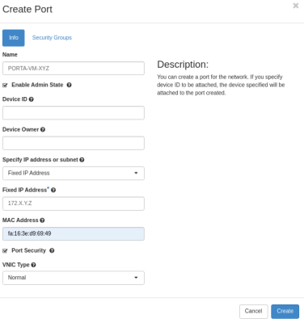

- O botão “Editar Porta” na coluna Actions de cada linha permite editar a porta ou
  clicando no link à esquerda na coluna Name e depois no botão “Editar Porta"

- Para excluir uma porta, pode-se tanto pelo botão 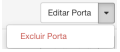na coluna
  Actions quanto marcando a caixa à esquerda de cada linha e clicando no botão
  **“Excluir Portas”**.

  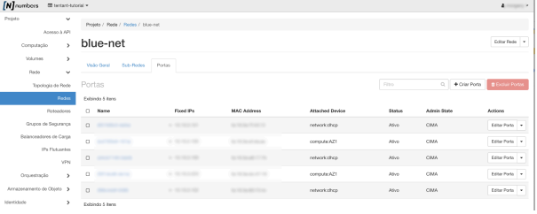

#### Pares de Endereços Permitidos

Um par de endereços permitido é quando você identifica um endereço MAC específico,
endereço IP ou ambos para permitir que o tráfego de rede passe por uma porta,
independentemente da sub-rede. Ao definir pares de endereços permitidos, você pode usar
protocolos como VRRP (Virtual Router Redundancy Protocol), que flutuam um endereço IP
entre duas instâncias de VM para permitir o failover rápido do plano de dados (data plane).

É possível especificar pares de quais endereços IPs (ou CIDR) e MAC são permitidos em
determinada porta de dispositivo computacional (e.g. attached device = compute:AZ1).
Para incluir um ou mais pares de endereços permitidos, clique no link do dispositivo
computacional (e.g. compute:`<zona-disponibilidade>`) na aba portas da rede selecionada:

Na aba “Pares de Endereços Permitidos”, clique no botão “Adicionar um Par de Endereços
Permitidos"

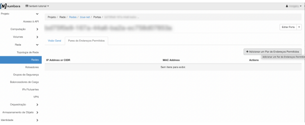

Informe o endereço IP ou um range de IPs através do formato de notação CIDR.
Informa o MAC address.

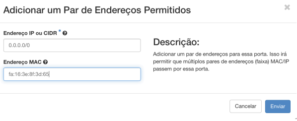
